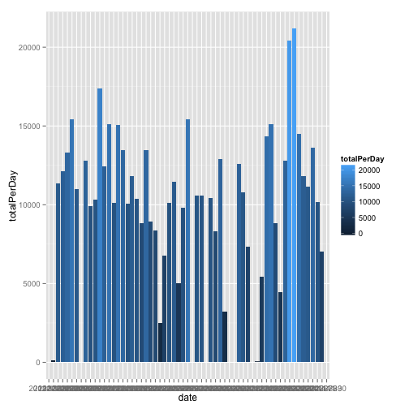

# Reproducible Research: Peer Assessment 1


## Loading and preprocessing the data
Set the working directory:

```r
setwd("~/Documents/Coursera/dataScienceSpecialisation/RepData_PeerAssessment1")
```


Read in the data:

```r
data <- read.csv("activity.csv")
```


Do some transformations to get the data ready for analysis:

```r
## Get Steps per day group data by 'date' and avg 'steps'
require(data.table)
```

```
## Loading required package: data.table
```

```r
data <- data.table(data)
dt <- data[, list(meanSteps = mean(steps, na.rm = TRUE), std = sd(steps, na.rm = TRUE), 
    totalPerDay = sum(steps, na.rm = TRUE)), by = date]
timeseries <- data[, list(meanSteps = mean(steps, na.rm = TRUE), std = sd(steps, 
    na.rm = TRUE), totalPerDay = sum(steps, na.rm = TRUE)), by = interval]
```


## What is mean total number of steps taken per day?
1. Histogram of total number of steps taken each day:

```r
require(ggplot2)
```

```
## Loading required package: ggplot2
```

```r

# Total Steps Per Day
ggplot(dt, aes(x = date, y = totalPerDay, fill = totalPerDay)) + geom_bar(stat = "identity")
```

 

```r

# Mean Steps Per Day ggplot(dt, aes(x=date, y=meanSteps, fill=meanSteps)) +
# geom_bar(stat='identity')

myMean <- mean(data$steps, na.rm = TRUE)
myMedian <- median(data$steps, na.rm = TRUE)
# median(dt$meanSteps, na.rm = TRUE)
```


**2. The mean and median total number of steps taken per day are:**  
**Mean**:       37.3826     
**Median**:     0   


## What is the average daily activity pattern?
### 1. Time Series Plot

```r
ggplot(timeseries, aes(interval, meanSteps)) + geom_line()
```

 


### 2. Which 5min Interval, on average across all days, contains maximum number of steps?

```r
intervalWithMaxSteps <- timeseries[which(meanSteps == max(timeseries$meanSteps)), 
    ]$interval
```

Therefore interval 835 has the maximum average number of steps per day.

## Imputing missing values
Calculate the total number of missing values in dataset.

```r
require(impute)
```

```
## Loading required package: impute
```

```r
missingVals <- nrow(data[which(is.na(data$steps) == TRUE), ])
missingVals
```

```
## [1] 2304
```

Total number of missing = 2304

### Fill in the missing numbers and save as a new dataset

```r
require(impute)

```


### Histogram of Total number of steps taken each day

```r
require(ggplot2)
plot <- ggplot(someData, aes(x = vaiable)) + geom_histogram(aes(y = ..something..))
```

```
## Error: object 'someData' not found
```


The mean and median total number of steps taken per day are:
| Summary   | Value        | 
| ----------|-------------:|
| Mean      | 'r myMean'   |
| Median    | 'r myMedian' |

### Effects of Imputing Missing Values on estimates of daily number of steps

## Are there differences in activity patterns between weekdays and weekends?
- Use weekdays() function
- Use dataset with filled in values

1. Create new factor in dataset with 2 levels "Weekday", "Weekend"
2. Make time series panel plot (type "l") x-axis = 5min interval, y-axis = avg steps taken


