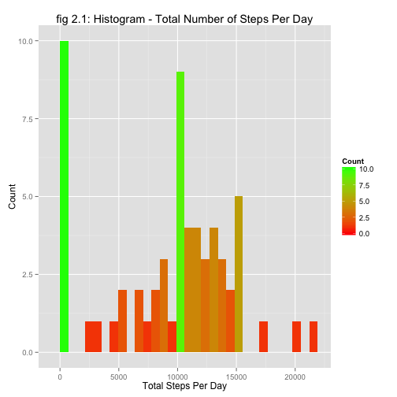
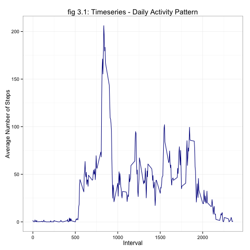
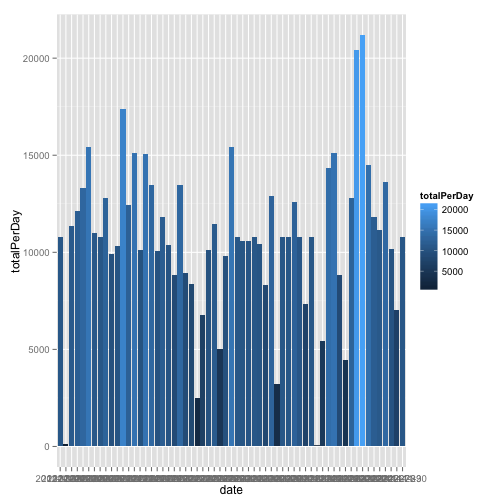
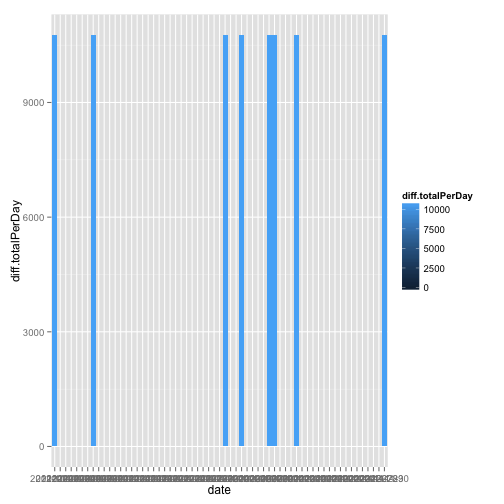
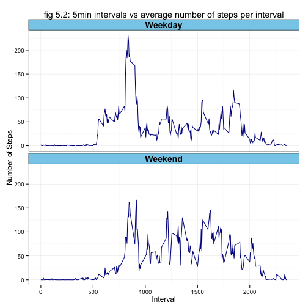

# Reproducible Research: Peer Assessment 1


## Loading and preprocessing the data
Set the working directory:

```r
setwd("~/Documents/Coursera/dataScienceSpecialisation/RepData_PeerAssessment1")
```

Read in the data:

```r
data <- read.csv("activity.csv")
```

Do some transformations to get the data ready for analysis:

```r
require(data.table)
```

```
## Loading required package: data.table
```


```r
## Get Steps per day
## group data by 'date' and find the mean of 'steps'
data <- data.table(data)
dt <- data[,list(meanSteps=mean(steps, na.rm=TRUE), std=sd(steps, na.rm=TRUE), totalPerDay=sum(steps, na.rm=TRUE)), by=date]
timeseries <- data[,list(meanSteps=mean(steps, na.rm=TRUE), std=sd(steps, na.rm=TRUE), totalPerDay=sum(steps, na.rm=TRUE)), by=interval]
```

## What is mean total number of steps taken per day?
1. Histogram of total number of steps taken each day:

```r
require(ggplot2)
```

```
## Loading required package: ggplot2
```

```r
# Total Steps Per Day
ggplot(dt, aes(x=date, y=totalPerDay, fill=totalPerDay)) + geom_bar(stat="identity")
```

 

```r
# Mean Steps Per Day
# ggplot(dt, aes(x=date, y=meanSteps, fill=meanSteps)) + geom_bar(stat="identity")

myMean <- mean(data$steps, na.rm = TRUE)
myMedian <- median(data$steps, na.rm = TRUE)
#median(dt$meanSteps, na.rm = TRUE)
```

**2. The mean and median total number of steps taken per day are:**  
**Mean**:       37.3826     
**Median**:     0   


## What is the average daily activity pattern?
### 1. Time Series Plot

```r
ggplot(timeseries, aes(interval, meanSteps)) + geom_line()
```

 

### 2. Which 5min Interval, on average across all days, contains maximum number of steps?

```r
intervalWithMaxSteps <- timeseries[which(meanSteps == max(timeseries$meanSteps)), ]$interval
```
Therefore interval 835 has the maximum average number of steps per day.


## Imputing missing values
### 1. Calculate the total number of missing values in dataset.

```r
numMissingVals  <- nrow(data[ complete.cases(data)==FALSE ])
numMissingVals
```

```
## [1] 2304
```
Total number of missing = 2304


### 2. Fill in the missing values using the min for the corresponding 5min interval

```r
## Strategy:
## Use the mean for that 5min interval to replace the mising values

coalesce2<-function(...){
  Reduce(function(x,y) {
    i<-which(is.na(x))
    x[i]<-y[i]
    x},
  list(...))
}

merged <- merge(data, timeseries, by = "interval")
merged$steps <- with(merged, coalesce2(steps, meanSteps))
```


### 3. New dataset equal to the original dataset but with the missing data filled in

```r
data2 <- subset(merged, select=cbind("steps","date","interval"))

print("The new dataset is: ")
```

```
## [1] "The new dataset is: "
```

```r
head(data2)      
```

```
##     steps       date interval
## 1:  1.717 2012-10-01        0
## 2:  0.000 2012-10-02        0
## 3:  0.000 2012-10-03        0
## 4: 47.000 2012-10-04        0
## 5:  0.000 2012-10-05        0
## 6:  0.000 2012-10-06        0
```


### 4. Histogram of Total number of steps taken each day

```r
dt2 <- data2[,list(meanSteps=mean(steps, na.rm=TRUE), std=sd(steps, na.rm=TRUE), totalPerDay=sum(steps, na.rm=TRUE)), by=date]

# Total Steps Per Day
ggplot(dt2, aes(x=date, y=totalPerDay, fill=totalPerDay)) + geom_bar(stat="identity")
```

 

```r
myMean2 <- mean(data2$steps, na.rm = TRUE)
myMedian2 <- median(data2$steps, na.rm = TRUE)
#median(dt$meanSteps, na.rm = TRUE)
```

**2. The mean and median total number of steps taken per day are:**  
**Mean**:       37.3826     
**Median**:     0   

Note the Mean and Median remain unchanged after replacing the missing values with the mean on the corresponding day.
However, total number of steps taken per day have increased as a result of replacing the missing values with the means.


### Effects of Imputing Missing Values on estimates of total daily number of steps
The effect of imputing missing values on the total daily number of steps is; eight values that were previously NAs now have values. This can be see in the figure below the the vertical bars representing the difference of the dataset with imputed values to the dataset with NAs.

#### Histogram - Difference in Total Number of Steps Per Day Resulting from Imputing Missing values

```r
diff <- dt2
diff$diff.totalPerDay <- dt2$totalPerDay - dt$totalPerDay

# Total Steps Per Day
ggplot(diff, aes(x=date, y=diff.totalPerDay, fill=diff.totalPerDay)) + geom_bar(stat="identity")
```

 

## Are there differences in activity patterns between weekdays and weekends?
- Use weekdays() function
- Use dataset with filled in values

### 1. Create new factor in dataset with 2 levels "Weekday", "Weekend"

```r
data2$date <- as.Date(data2$date)
data2$weekdayName  <- with(data2, weekdays(date))
data2$weekdayFlag <- factor(with(data2, ifelse(weekdays(date) %in% c("Monday","Tuesday", "Wednesday","Thursday", "Friday")  ,"Weekday" ,"Weekend" )) )

timeseries2 <- data2[,list(meanSteps=mean(steps, na.rm=TRUE), std=sd(steps, na.rm=TRUE), totalPerDay=sum(steps, na.rm=TRUE)), by=c("weekdayFlag","interval")]
```


### 2. Make time series panel plot (type "l") x-axis = 5min interval, y-axis = avg steps taken

```r
m <- ggplot(timeseries2, aes(interval, meanSteps)) 
m <- m + geom_line() 
m <- m + facet_wrap(~weekdayFlag, nrow=2, ncol=1)
m <- m + xlab("Interval")
m <- m + ylab("Number of Steps")
m <- m + ggtitle("Timeseries plot of 5min intervals and the average number of steps taken per interval")
m
```

 


