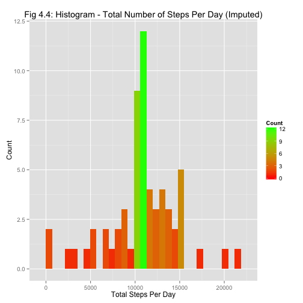
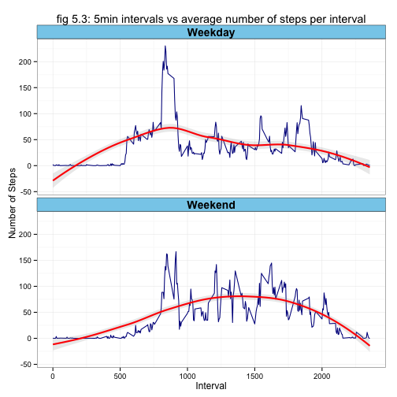

# Reproducible Research: Peer Assessment 1


## 1. Loading and preprocessing the data
Set the working directory:

```r
setwd("~/Documents/Coursera/dataScienceSpecialisation/RepData_PeerAssessment1")
```

Read in the data:

```r
data <- read.csv("activity.csv")
```

Do some transformations to get the data ready for analysis:

```r
require(data.table)
```

```
## Loading required package: data.table
```


```r
## Get Steps per day
## group data by 'date' and find the mean of 'steps'
data <- data.table(data)
dt <- data[,list(meanSteps=mean(steps, na.rm=TRUE), std=sd(steps, na.rm=TRUE), totalPerDay=sum(steps, na.rm=TRUE)), by=date]
timeseries <- data[,list(meanSteps=mean(steps, na.rm=TRUE), std=sd(steps, na.rm=TRUE), totalPerDay=sum(steps, na.rm=TRUE)), by=interval]
```

## 2. What is mean total number of steps taken per day?
### 2.1 Histogram of total number of steps taken each day:

```r
require(ggplot2)

# Histogram: Total Steps Per Day
hist1 <- ggplot(dt, aes(x=totalPerDay)) 
hist1 <- hist1 + geom_histogram(aes(fill=..count..))
hist1 <- hist1 + scale_fill_gradient("Count", low = "red", high = "green")
hist1 <- hist1 + ylab("Count")
hist1 <- hist1 + xlab("Total Steps Per Day")
hist1 <- hist1 + ggtitle("fig 2.1: Histogram - Total Number of Steps Per Day")
hist1
```

 

```r
myMean <- mean(data$steps, na.rm = TRUE)
myMedianTotDaySteps <- median(dt$totalPerDay, na.rm = TRUE)
myMedianAcrossAllIntervals <- median(data$steps, na.rm = TRUE)
myMedianDailyAve <- median(dt$meanSteps, na.rm = TRUE)
```
  
### 2.2 The mean and median total number of steps taken per day are:  
#### Mean:       37.3826     
#### Median of Total Steps per Day: 10395 
#### Median Across All Intervals:     0 
#### Median of Daily Average Steps: 37.3785
  
  
## 3. What is the average daily activity pattern?
### 3.1 Time Series Plot

```r
m <- ggplot(timeseries, aes(interval, meanSteps)) 
m <- m + geom_line(colour="darkblue")
m <- m + theme_bw()
m <- m + ggtitle("fig 3.1: Timeseries - Daily Activity Pattern")
m <- m + xlab("Interval") + ylab("Average Number of Steps") 
m
```

 

### 3.2 Which 5min Interval, on average across all days, contains maximum number of steps?

```r
intervalWithMaxSteps <- timeseries[which(meanSteps == max(timeseries$meanSteps)), ]$interval
```
Therefore interval 835 has the maximum average number of steps per day.


## 4. Imputing missing values
### 4.1 Calculate the total number of missing values in dataset.

```r
numMissingVals  <- nrow(data[ complete.cases(data)==FALSE ])
numMissingVals
```

```
## [1] 2304
```
#### Total number of missing = 2304
  
  
### 4.2 Fill in the missing values using the min for the corresponding 5min interval

```r
## Strategy:
## Use the mean for that 5min interval to replace the mising values

## Build a custom coalesce function
coalesce2<-function(...){
  Reduce(function(x,y) {
    i<-which(is.na(x))
    x[i]<-y[i]
    x},
  list(...))
}

## Join the original Data with the Time Series data by the common column "interval"
merged <- merge(data, timeseries, by = "interval")

## Where steps is NA in the original dataset, replace it with the mean number of steps for that interval
merged$steps <- with(merged, coalesce2(steps, meanSteps))
```


### 4.3 New dataset equal to the original dataset but with the missing data filled in

```r
data2 <- subset(merged, select=cbind("steps","date","interval"))
```

See head of new dataset below. _Notice there are no NAs here._

```
##     steps       date interval
## 1:  1.717 2012-10-01        0
## 2:  0.000 2012-10-02        0
## 3:  0.000 2012-10-03        0
## 4: 47.000 2012-10-04        0
## 5:  0.000 2012-10-05        0
## 6:  0.000 2012-10-06        0
```
  

### 4.4 Histogram of Total number of steps taken each day

```r
dt2 <- data2[,list(meanSteps=mean(steps, na.rm=TRUE), std=sd(steps, na.rm=TRUE), totalPerDay=sum(steps, na.rm=TRUE)), by=date]

# Histogram: Total Steps Per Day
hist2 <- ggplot(dt2, aes(x=totalPerDay)) 
hist2 <- hist2 + geom_histogram(aes(fill=..count..))
hist2 <- hist2 + scale_fill_gradient("Count", low = "red", high = "green")
hist2 <- hist2 + ylab("Count")
hist2 <- hist2 + xlab("Total Steps Per Day")
hist2 <- hist2 + ggtitle("Fig 4.4: Histogram - Total Number of Steps Per Day (Imputed)")
hist2
```

 

```r
myMean2 <- mean(data2$steps, na.rm = TRUE)
myMedianTotDaySteps2 <- median(dt2$totalPerDay, na.rm = TRUE)
myMedianAcrossAllIntervals2 <- median(data2$steps, na.rm = TRUE)
myMedianDailyAve2 <- median(dt2$meanSteps, na.rm = TRUE)
```


### 4.5 The mean and median total number of steps taken per day are:  
#### Mean:       37.3826   
#### Median of Total Steps per Day: 1.0766 &times; 10<sup>4</sup> 
#### Median Across All Days:     0 
#### Median of Daily Averages: 37.3826
  

### 4.6 Do these values differ from the estimates from the first part of the assignment? 
Note the **Mean** remains unchanged after replacing the missing values with the mean of the corresponding day. However, the **Median of Total Steps per Day** has increased by 371.1887 steps.
  
Other insights include the **Median Across All Intervals** remains unchanged and the **Median of Daily Averages** differs by 0.0041. 
  
### 4.7 Effects of Imputing Missing Values on estimates of total daily number of steps
The total number of steps taken per day have increased on eight days as a result of replacing the missing values with the means. These eight days previously had NAs and now have values. This can be see in the figure below where some of the green bar on the left of fig 2.1 has moved to the middle of the histogram in fig 4.4 (Imputed Values). 

#### Histogram - Difference in Total Number of Steps Per Day Resulting from Imputing Missing values
 

## 5. Are there differences in activity patterns between weekdays and weekends?
- Use weekdays() function
- Use dataset with filled in values

### 5.1 Create new factor in dataset with 2 levels "Weekday", "Weekend"

```r
data2$date <- as.Date(data2$date)
data2$weekdayName  <- with(data2, weekdays(date))
data2$weekdayFlag <- factor(with(data2, ifelse(weekdays(date) %in% c("Monday","Tuesday", "Wednesday","Thursday", "Friday")  ,"Weekday" ,"Weekend" )) )

timeseries2 <- data2[,list(meanSteps=mean(steps, na.rm=TRUE), std=sd(steps, na.rm=TRUE), totalPerDay=sum(steps, na.rm=TRUE)), by=c("weekdayFlag","interval")]
```


### 5.2 Make time series panel plot (type "l") x-axis = 5min interval, y-axis = avg steps taken

```r
m <- ggplot(timeseries2, aes(interval, meanSteps)) 
m <- m + geom_line(colour="darkblue") 
m <- m + facet_wrap(~weekdayFlag, nrow=2, ncol=1)
m <- m + xlab("Interval")
m <- m + ylab("Number of Steps")
m <- m + ggtitle("fig 5.2: 5min intervals vs average number of steps per interval")
m <- m + theme_bw()
m <- m + theme(strip.text.x = element_text(size=14, face="bold"),
          strip.background = element_rect(colour="black", fill="skyblue"))
m
```

 

### 5.3 Plot with Smoothed Conditional Mean

 


  
 
  
#### Conculsion
- There are there differences in activity patterns between weekdays and weekends. Activity tends to start later and more gradually on weekends than on weekdays according to plot 5.2. For weekends it starts from interval 500 onwards very gradually. Whereas for weekdays it begins from interval 500 onwards very abruptly.

- For weekdays activity tends to be more periodic with a spike every few hours, whereas weekends do not exhibit this periodic nature. 

- Weekend activity tends to cease later in the day with a large spike just after interval 2000. Whereas weekday activity more abrubtly ends just after interval 1550


